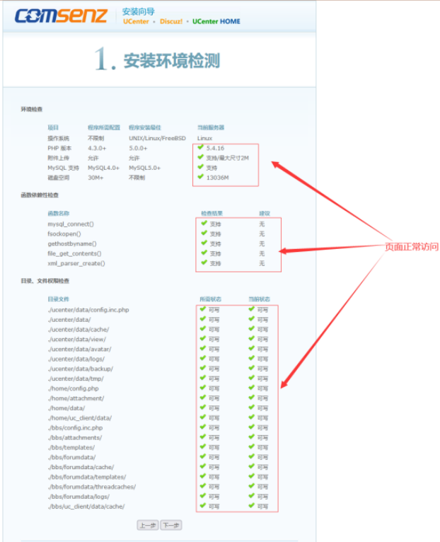

## qq农场项目

### 安装过程

#### 1、安装apache mysql php

```
yum install httpd php php-mysql -y
yum install unzip -y
进入resources目录
unzip Mysql_package.zip
cd package
yum localinstall * -y
```

#### 2、启动MySQL、httpd并修改配置文件

```
# 更改mysql密码
grep password /var/log/mysqld.log
mysqladmin -uroot -p'旧密码' password '新密码'
#修改httpd配置文件，使其支持php
vim /etc/httpd/conf/httpd.conf
找到index.html 在后面添加index.php
#编写虚拟主机
vim /etc/httpd/conf.d/qqfarm.conf  数据存放在/qqfarm目录下

<Directory "/qqfarm">
 AllowOverride None
 Require all granted
</Directory>
<VirtualHost 你的服务器IP:80>
 ServerAdmin root@localhost
 DocumentRoot "/qqfarm"
 ServerName qqfarm.cc.com
</VirtualHost>
```

#### 3、将upload目录拷贝到/qqfarm目录下并修改文件权限

```
chmod 777 -R /qqfarm/bbs/ /qqfarm/home/ /qqfarm/ucenter/
```

#### 4、创建qqfarm数据库，导入/qqfarm/qqfarm.sql文件到数据库中

```
mysql -uroot -p'密码' -e "create database qqfarm;"
mysql -uroot -p'密码' -D qqfarm < /qqfarm/qqfarm.sql
```

#### 5、访问地址

```
systemctl restart httpd
http://部署的机器IP/home
```

#### 6、安装




